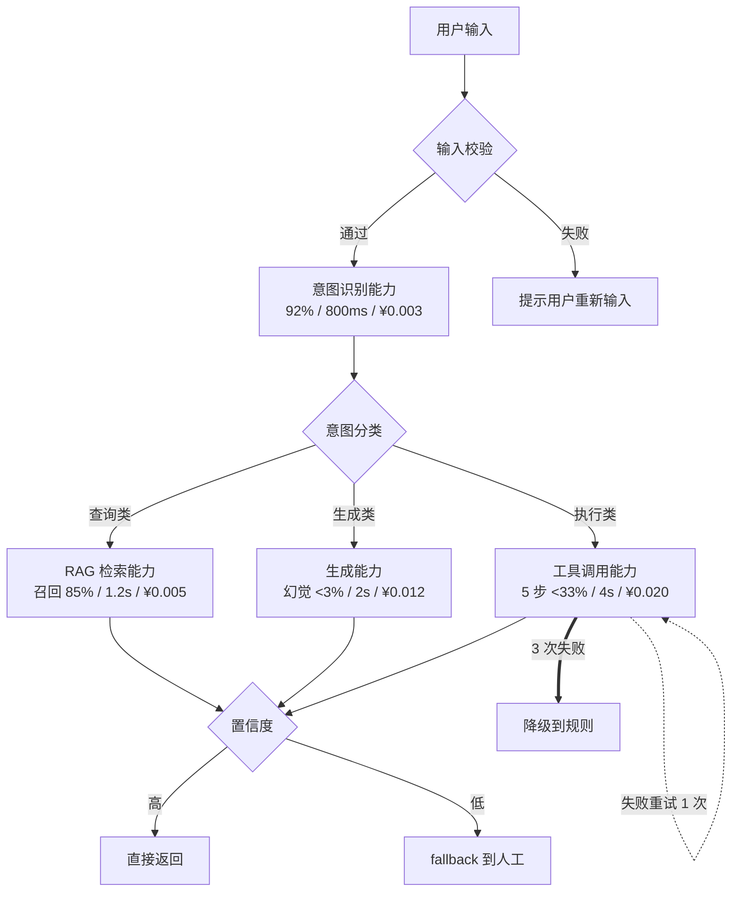

# AI 产品能力边界工具包 v1.0

> 覆盖第 02 / 03 / 05 / 06 / 07 / 10 共 6 篇正文
> **一句话定位**：从「需求 → 评审 → 方案 → 技术路径」全链路，每一步给一张能立刻用的表 + 一个判断阈值 + 一个真实翻车案例
> **用法**：6 模块对应 6 篇正文，可单独抽出来印 A4 贴工位

---

## 0 · 工具包总图

| 模块 | 服务正文 | 用在什么时候 | 5 秒钟产出 |
|---|---|---|---|
| **A · 6 元素 PRD 验收** | #02 | 写 PRD 时 | 6 元素填空表 |
| **B · 真实需求挖掘 6 问 + 访谈新模板** | #03 | 立项前 | 6 问打分 + 5 段访谈脚本 |
| **C · Agent 4 类硬边界自评表** | #05 | 评审前 | 4 项 yes/no + 越界降级 |
| **D · PMF 5 信号 checklist** | #06 | 上线后 30/60/90 天 | 5 项达标判断 |
| **E · 能力流图模板 + 3 示范** | #07 | 方案设计时 | 1 张图 + 3 例 |
| **F · 技术路径决策树** | #10 | 选 RAG / Agent / FT 前 | 4 问倒推 + 决策表 |
| **G · 设计依据 + 批判性自评** | 全包 | 给读者交代来源 | 透明度声明 |

> **跑通顺序**：B → C → A → E → F → D（先看真不真 → 做不做得了 → 写 PRD → 画能力流图 → 选技术路径 → 上线后看 PMF）

---

# 模块 A · 6 元素 PRD 验收表（服务第 02 篇）

> 90% 的 PM 写 AI 产品 PRD 时还在用「页面 + 按钮」的传统功能模板——工程师拿到 PRD 心里默默重写一份，沟通成本翻 3 倍，上线即翻车。

## A.1 6 元素清单

**参照源**：Miqdad Jaffer（OpenAI Product Lead）5 维 PRD + Scrum.org DoD 4 项 + Google/Cambridge Card。**蔡逸雯版 6 元素**——把以上 3 套合并 + 加一项「延迟」（工程现实里 p99 决定能不能上线）。

| # | 元素 | 一句话 | 不写的代价 |
|---|---|---|---|
| 1 | **输入 schema** | 用户/系统给模型的数据格式、上限、必填项 | 工程师写不出接口 |
| 2 | **输出 schema** | 模型返回的格式、字段、可选值 | 前端永远在改 |
| 3 | **准确率分布** | 不是平均值，是 100+ case 的分布 | 没法验收 |
| 4 | **延迟 p99** | 最慢 1% 请求要多久 | 上线后被骂卡 |
| 5 | **成本** | ¥/次 + 月成本 | CFO 找你算账 |
| 6 | **失败兜底** | 失败时用户看到什么、谁兜底 | 上线第一周回滚 |

## A.2 元素 1：输入 schema 验收

| 检查项 | 通过标准 | 反例 | 正例 |
|---|---|---|---|
| 数据类型 | 明确列举 | "用户输入的东西" | text(string, max 8000 chars) |
| 长度上限 | token 或字符数 | "不要太长" | ≤ 8000 chars / ≤ 4096 tokens |
| 必填 / 可选 | 字段级标注 | "带上必要信息" | required: query；optional: context, history |
| 编码格式 | 明确 charset / 文件类型 | "常见格式" | UTF-8 / PDF/A-1b / PNG ≤ 5MB |
| 边界 case | 至少 3 种异常输入 | 不写 | 空输入 / 超长 / 含特殊符号 |
| 隐私分类 | 是否含 PII | 不分类 | 含 PII → 必须 redaction 预处理 |

**通过模板**：
```yaml
input:
  type: text
  encoding: UTF-8
  max_chars: 8000
  max_tokens: 4096
  required_fields:
    - query: string
  optional_fields:
    - context: string (≤ 2000 chars)
    - history: array[message] (≤ 10 items)
  edge_cases:
    - empty_input: 返回 "请输入问题"
    - over_length: 截断到 8000 chars + 提示
    - special_chars: ​ 等零宽字符 sanitize
  privacy_class: "L2 - 可能含 PII，前置 redaction"
```

## A.3 元素 2：输出 schema 验收

| 检查项 | 通过示例 |
|---|---|
| 格式 | JSON Schema 全文 |
| 字段类型 | confidence: float [0, 1] |
| 枚举值 | category ∈ {bug, feature, question, other} |
| 长度上限 | max_tokens: 1024 |
| 置信度 | 必带 confidence |
| 失败时的输出格式 | 失败时也要符合 schema |

```yaml
output:
  format: JSON
  schema:
    answer: string (≤ 1024 tokens)
    confidence: float [0, 1]
    sources: array[string] (≤ 5 items, optional)
  max_tokens: 1024
  on_failure:
    schema_preserved: true
    error_format: {error_code: int, message: string, fallback_text: string}
```

## A.4 元素 3：准确率分布验收（不是单一数字！）

**这是 6 元素里最容易写错的**。90% 的 PM 写「准确率 ≥ 90%」就完事——空话。

**Anthropic 统计方法论文**强调：评测结果**必须带置信区间**。0.85 vs 0.87 在小样本下可能不显著。

```yaml
accuracy:
  evaluation_set:
    size: 200 cases
    composition:
      - normal: 120 cases (60%)
      - edge: 40 cases (20%)
      - adversarial: 40 cases (20%)
    labeling:
      annotators: 3 (independent)
      IRR: ≥ 0.85 (Cohen's kappa)
  results:
    overall: 92% ± 2.3% (95% CI)
    by_category:
      normal: 96%
      edge: 88%
      adversarial: 73%
    confidence_band:
      "≥ 0.8 confidence": 98% accuracy
      "< 0.8 confidence": 67% accuracy (走兜底)
  regression_threshold: "新版本不能让任一 category < 当前 - 3%"
```

**反共识金句**：**追求 100% 准确率的产品，最后都做不到 100%——会把"看起来 100%"上线，结果生产环境分布外样本一打就露馅**。

正确写法是「**95% case 通过线 + 5% 兜底机制**」。

## A.5 元素 4：延迟 p99 验收

| 场景 | p50 | p95 | p99 |
|---|---|---|---|
| 同步对话 | < 1s | < 3s | < 5s |
| 异步任务 | < 10s | < 30s | < 60s |
| 长任务（RAG / Agent） | < 30s | < 120s | < 300s（必须 streaming + 进度提示） |

**为什么必须写 p99 不是 p50**：p50 漂亮没用。**用户记住的不是平均体验，是最差体验**。

## A.6 元素 5：成本验收（CFO 视角）

```yaml
cost:
  per_call:
    input_tokens: avg 1200 × $0.003/1k = $0.0036
    output_tokens: avg 400 × $0.015/1k = $0.006
    embedding: 1 × $0.0001
    total: ¥0.07
  per_user_per_month:
    avg_calls: 60
    cost: ¥4.2
  total_monthly (10 万 MAU):
    LLM: ¥420,000
    infra: ¥80,000
    total: ¥500,000
  budget_alert:
    yellow: > ¥600,000 (告警)
    red: > ¥800,000 (自动降级)
  unit_economics:
    revenue_per_user: ¥29.9/月
    margin: 86% ✅
```

**真实案例**：**Cursor 2025-06 billing 暴雷**——老用户单周烧到 $350，月成本涨 10-20 倍，CEO 7-04 道歉退款。**老板看完会问"我们家会不会也这样？"——PM 答不上来 = 不在岗**。

## A.7 元素 6：失败兜底验收

| 失败类型 | 触发条件 | 兜底策略 | 用户感知 |
|---|---|---|---|
| 模型超时 | latency > p99 + 50% | retry 1 次；仍超时 → 降级到便宜模型 | "稍候..." 进度条 |
| 模型 refusal | 输出含拒绝 token | 切换通用回答模板 | "您的问题超出我的能力，建议..." |
| 低置信度 | confidence < 0.6 | 提示用户重新表述 / 路由到人工 | "我不太确定，您是否想问..." |
| Schema 不符 | output 不通过 validation | 重新生成（max 2 次）→ 仍失败返回 fallback | 用户感知不到 |
| 工具调用失败 | tool error / API down | 切到备用工具 / 跳过该步 | 部分功能不可用 |
| Token 超额 | 单用户日成本 > ¥5 | 限速 + 提示 | "今日免费额度用完..." |

## A.8 6 元素 PRD 验收 checklist

| 元素 | 我写了 | 我没写 |
|---|---|---|
| 1. input schema 完整 | □ | □ |
| 2. output schema + on_failure | □ | □ |
| 3. accuracy 含 evaluation set + 分布 + CI | □ | □ |
| 4. latency p50/p95/p99 | □ | □ |
| 5. 成本 per_call + per_user + monthly | □ | □ |
| 6. fallback 至少 4 类失败 | □ | □ |

**通过**：6 个全勾 → 工程师可开工。任一项没勾 → 返工。

---

# 模块 B · 真实需求挖掘 6 问 + 访谈新模板（服务第 03 篇）

## B.1 真实需求 6 问（不同于 #48 的真伪 6 问）

每次接需求 PM 自己心里默念：

| # | 问题 | 表面答案（伪需求） | 深层答案（真需求） |
|---|---|---|---|
| Q1 | 用户**现在**用什么解决？ | 「他们想要 AI」 | 「他们用 Excel + ChatGPT + 复制粘贴，每天 2 小时」 |
| Q2 | 哪一步**最烦**？ | 「整个流程都烦」 | 「Excel 跨表格匹配，每次找 5 分钟」 |
| Q3 | 用户付费的是**结果**还是**过程**？ | 「都付」 | 「付的是结果——能不能省 1.5 小时」 |
| Q4 | 错一次的**真实代价**？ | 「错了重新来」 | 「错一次客户退订 ¥500，重新做 30 分钟」 |
| Q5 | 用户**自己试**过 AI 做这件事吗？ | 「应该试过」 | 「试过 3 次都崩了——他知道现状 AI 做不到」 |
| Q6 | 如果 AI 80% 准确，**用户能用吗**？ | 「能用」 | 「不能用——他要 95% 否则信用风险大于省时间」 |

### 6 问判读规则

- Q1-Q3 答得清 → 用户真有这个问题
- Q4-Q6 答得清 → AI 方案能闭环
- 6 问全清 → 真需求，立项
- **Q5 答「不知道用户有没有试过」** → 立刻去看小红书 / 即刻 / X 上的吐槽
- **Q6 答「80% 不行 95% 才能用」** → 99% 概率做不出来，砍掉或降级

## B.2 AI 时代用户访谈新模板（Teresa Torres 风格 + AI 适配）

### 传统 vs AI 访谈

| 维度 | 传统 | AI 时代 |
|---|---|---|
| 问什么 | "你想要什么 AI" | "你**现在用 ChatGPT 在偷偷做什么**" |
| 看什么 | 用户说的话 | **用户的 ChatGPT 历史 + 浏览器 tab** |
| 输出 | persona + 用户故事 | trace + bad case 标注 + 评估集 |
| 时长 | 60 分钟 | **30 分钟谈话 + 60 分钟看屏幕** |

> **Teresa Torres**（2025 webinar）："客户访谈本身要变。AI 产品 outcome 不是确定性的——不能再问'你想要什么'，而要 **log traces / 让人审 / 标错误类 / 写 evals / A/B 测修复**。"

### 5 段式访谈脚本（30 分钟）

**段 1：现状（5 分钟）—— 看行为不问意愿**
- Q1: "**上次**你处理 [这个任务] 是什么时候？带我过一遍当时做了什么"
- Q2: "你电脑现在能打开吗？打开当时用的工具给我看"
- Q3: "一周做几次？每次多久？"

**段 2：最烦的一步（5 分钟）**
- Q4: "整个流程里哪一步最烦？为什么？"
- Q5: "这一步消失，你愿意为它付多少钱？"

**段 3：AI 试过吗（5 分钟）—— AI 时代独有**
- Q6: "用 ChatGPT / Claude / Kimi 试过吗？"
- Q7: "能给我看你跟 AI 的对话记录吗？" ← **金矿，直接进 eval set**
- Q8: "AI 答到什么程度算'够用'？什么程度算'不行'？"

**段 4：付费测试（5 分钟）**
- Q9: "如果有工具能省 70% 这一步时间，月付 ¥X 你愿意吗？"
- Q10: "如果错 1 次，损失是什么？还会继续付费吗？"

**段 5：开放（5 分钟）—— 收集 bad case**
- Q11: "你最近被 AI 气到的一次是什么？"
- Q12: "你有什么想问我的？"

### 访谈输出 3 种新形态

传统输出"用户故事"。AI 访谈必须额外输出：
1. **真实 prompt 库 ≥ 20 条**——用户在 ChatGPT 真实对话，**直接进 eval set**
2. **真实 bad case 标注 ≥ 10 条**——用户被气到的 case + 原因
3. **真实付费意愿曲线**——价格 × 准确率门槛矩阵

**反共识**：**"AI 时代的访谈不是问'你想要什么'，是看'你已经在 ChatGPT 里偷偷做什么'"**

## B.3 访谈样本量

| 阶段 | 目标 | 推荐样本量 |
|---|---|---|
| 早期探索 | 找 unmet need | 5 人（深度 60 min/人） |
| 假设验证 | 验证 6 问 | 8-12 人 |
| 上线前 | 收 eval + bad case | 20-30 人 |
| 上线后 | 持续 discovery | 每月 5 人（rolling） |

**反常识**：AI 产品样本量需求**比传统产品低**——你不是收"愿望"，是收"prompt 行为"，后者更结构化。

---

# 模块 C · Agent 4 类硬边界自评表（服务第 05 篇）

## C.1 4 类硬边界总表

| 边界 | 判断阈值 | 越界灾难 | 真实案例 |
|---|---|---|---|
| **1. 长任务链能力** | 任务时长 > 30 分钟 / 步数 > 20 步 | 指数级累积错误 | Manus AI |
| **2. 长上下文 + 高准确** | 上下文 > 100K + 要求 95%+ | retrieval 救不了 | DPD |
| **3. 专业领域门槛** | 医疗 / 法律 / 金融 / 强合规 | 幻觉 + 合规风险 | Air Canada |
| **4. 多步推理可靠性** | 推理跳数 > 3 / 工具 > 5 | 幻觉式融合 | Anthropic 58 工具 |

## C.2 边界 1：长任务链（METR Horizon Length）

**识别信号**：
- ❌ 需求里有「全自动」「端到端」「从 A 到 Z」
- ❌ 任务时长（人类完成）> 30 分钟
- ❌ 步数 > 20
- ❌ 每步都不能错

**METR 数据（v1.1, 2026-01）**：

| 模型 | 50% 时间 horizon | 80% 时间 horizon |
|---|---|---|
| GPT-4o | ~30 min | ~5 min |
| Claude Opus 4.6 | 14.5 hr | ~1.5 hr |
| **Claude Mythos**（2026-05） | **~16 hr** | **3 hr 6 min** |

**关键 trend**：原 METR doubling 7 个月翻倍 → v1.1 post-2023 **doubling 4.3 个月**。80% 可靠区间远低于 50%——意味着 **SOTA 看起来能做 14 小时，生产可靠区间还在 1.5 小时**。

**真实案例：Manus AI 演示 SOTA 但生产崩**
- 2025-03 launch，宣称 GAIA Level 1 86.5%
- 实测：频繁崩溃 / 撞 CAPTCHA / 下载空 ZIP / 跑满上下文丢状态
- **reliability < 50% 真实长任务场景**
- **核心**：benchmark SOTA ≠ 生产可用

**规避方法**：
| 越界程度 | 规避 |
|---|---|
| 轻度（30-60 min）| AI 跑 + 关键节点人工确认 |
| 中度（1-3 hr） | 拆 3-5 个 sub-agent，每个 < 30 min，checkpoint |
| 重度（> 3 hr） | 改成「AI 推荐 → 人执行」 |

**金句**：**"长 Agent 的工程美学不是跑得更远，是让它在第 3 步就乖乖停下来求救"**

## C.3 边界 2：长上下文 + 高准确

**识别信号**：
- ❌ 「整个法律文档库」「全公司知识库」「过去 3 年所有合同」
- ❌ 上下文 token > 100K
- ❌ 同时要求准确率 ≥ 95%
- ❌ 用户不接受"模型查不到"

**为什么 retrieval 救不了**：
- needle in haystack：100K context 找单一事实，准确率 80-90%
- multi-needle（5 个事实）：60-70%
- reasoning over long context：< 50%

**Jerry Liu（LlamaIndex）2026 观察**：长 context 不是「文档塞进去就完事」——需要 chunk + retrieve + rerank + generate 完整 pipeline。**做 RAG 不是建向量库，是建 pipeline**。

**真实案例：DPD chatbot（2024-01）**
- 上 LLM chatbot，用户问"我的包裹没到"
- bot 不仅答非所问，**还编了一首骂自家公司的诗**
- 截图 X 800K+ 转发，紧急下线

**根因**：长上下文 + 多任务（追踪查询 + 自由对话）= 模型 drift 到非业务模式

**规避方法**：
| 越界程度 | 规避 |
|---|---|
| 50-100K | RAG + rerank + LLM-judge 二次验证 |
| 100-500K | 拆任务 |
| > 500K 或 95%+ 准确 | **不做这个需求**，改成「人 + AI 辅助检索」|

## C.4 边界 3：专业领域门槛

**识别信号**：医疗诊断 / 法律咨询 / 金融决策 / 政府服务 / 心理健康 / 教育（未成年人）

**Stanford RegLab 数据**（2024-2025）：

| 法律 AI 工具 | 幻觉率 |
|---|---|
| Lexis+ AI | 17%（号称 hallucination-free + RAG） |
| Westlaw AI Research | 33% |
| GPT-4 | 43% |

**关键洞察**：「**号称 hallucination-free + RAG 的法律 AI 仍有 17% 幻觉**」——每 6 个回答有 1 个是编的，用专业术语包装得像真的。

**真实案例 1：Air Canada（2024 BCCRT 149）**
- chatbot 编造丧亲票政策
- BC 仲裁庭判赔 CAD 650.88
- 判例：**bot 说的话 = 公司说的话**（AI 输出 = 法律意义上公司输出）

**真实案例 2：McDonald's × IBM**
- 100+ 门店 2 年 / 85% 准确率 + 1/5 单需人工
- 快餐场景 = 100% 翻车（15% 失败被拍 TikTok）
- 2024-06 终止

**规避方法**：
- 强合规：**不做 AI 独立决策**，只做「AI 辅助 + 人审 + audit log」
- 专业术语高：每个术语都要有 ground truth 来源
- 监管披露：明确告知用户（Texas TRAIGA 强制医师披露）

## C.5 边界 4：多步推理可靠性

**识别信号**：
- ❌ 一句话需求里 ≥ 4 个动词
- ❌ 工具调用 ≥ 5 步
- ❌ 流程图有 ≥ 3 个决策分支
- ❌ 不可枚举的分支组合

**Anthropic 58 工具 + Tool Search 数据**（2026-05）：
- **5 个 MCP server = 58 个工具，吃 ~55K token**（对话还没开始）
- **不开 Tool Search**：Opus 4.5 准确率 **79.5%**
- **开 Tool Search**（动态发现）：准确率 → **88.1%**
- Hermes Agent 实测：49% → 74%

**推算 5 步成功率**：
- 单步 80% → 5 步 = 0.8^5 = **32.8%**（不到 1/3）
- 单步 88% → 5 步 = **52.8%**（刚过一半）
- 单步 95% → 5 步 = **77.4%**（仍 1/4 失败）

**真实案例**：Anthropic 自家工程博客 self-report——30+ 工具就要做 Tool Search 否则崩。Claude Opus 4.5（2026）才把 tool selection 从 79.5% → 88.1%。**Anthropic 自己都需要专门优化才搞定 5 步**——其他团队凭什么开箱即用。

**规避方法**：
| 越界程度 | 规避 |
|---|---|
| 工具 5-15 | 减少工具 |
| 工具 15-30 | 开 Tool Search |
| 工具 30+ | 拆 sub-agent，每个 < 15 工具 |
| 推理 4+ 跳 | chain-of-thought 显式化每跳，每跳独立 eval |

## C.6 4 类边界自评 checklist（评审会现场用）

| 边界 | 我的需求是否越界？ | 程度 | 规避 |
|---|---|---|---|
| 1. 长任务链 | □ 未越界 / □ 30-60 min / □ > 1 hr | | |
| 2. 长上下文 | □ < 50K / □ 50-100K / □ > 100K | | |
| 3. 专业领域 | □ 无 / □ 部分 / □ 强合规 | | |
| 4. 多步推理 | □ ≤ 3 跳 ≤ 5 工具 / □ 越 1 / □ 越多 | | |

**判读**：
- 0 越界：放心做
- 1 越界：必须设计降级
- 2 越界：拆需求或砍掉
- 3+ 越界：**这个需求不该立项**

## C.7 4 类边界 12 个月会怎么变

**4 类边界数字是 2026-Q2 模型快照**——不是常量。

| 边界 | 当前 | 12 个月后预测 | 依据 |
|---|---|---|---|
| 1. 长任务链 | 30 min | 60-120 min | METR doubling 4.3 个月 |
| 2. 长上下文 | 100K + 95% | 500K + 90% | Gemini 3 / Claude Mythos |
| 3. 专业领域 | 法律幻觉 17%+ | 法律幻觉 10-15% | RAG + reasoning model 改善 |
| 4. 多步推理 | 5 步 / 30 工具 | 10 步 / 50 工具 | Tool Search + Skills 范式 |

**核心纪律**：**每 6 个月重测一次边界**。

---

# 模块 D · PMF 5 信号 Checklist（服务第 06 篇）

> 传统 SaaS 的 PMF 信号（NPS、留存、付费转化）在 AI 产品上**部分失效**——AI 产品价值感知比传统 SaaS 更不稳定。

## D.1 蔡逸雯 5 信号

| 信号 | 一句话定义 | 传统 PMF 差异 |
|---|---|---|
| **1. Prompt 复用率** | 同一用户对同类问题愿意重新打开你的产品而不是再去 ChatGPT | 传统看 DAU/MAU，AI 看「为什么不用 ChatGPT」 |
| **2. Bad case 投诉率单调下降** | 每月 bad case / 总 case 比例**稳定下降** | 传统看 bug 总数，AI 看演化 |
| **3. 用户自发分享 prompt** | 用户主动在小红书 / X / 即刻分享他们的 prompt | 传统看 NPS，AI 看免费分销 |
| **4. 付费用户主动升档** | 不是"续费"，是"主动从 ¥29 升到 ¥99" | 传统看续费，AI 看升档（价值上限被认可） |
| **5. 模型升级时用户感受到"变好"** | GPT-5 → 5.5 时用户主动留言「最近变聪明了」 | 只有 AI 产品有这种信号 |

## D.2 信号 1：Prompt 复用率

**定义**：同用户 7 天内对相似 query 类型重新选择你的产品而不是 ChatGPT 的比例

**衡量**：埋点问"今天有没有为 [X 类问题] 用其他 AI"；或 7 天 retention × query 类型聚类（**task retention**）

**阈值**：
- 🟢 ≥ 60%：强 PMF
- 🟡 40-60%：弱 PMF
- 🔴 < 40%：用户拿你当 demo

**真实案例**：Cursor——程序员 95%+ 时间用 Cursor 而不是 ChatGPT，**因为 Cursor 在"写代码"task 上专门优化**

## D.3 信号 2：Bad case 投诉率单调下降

**定义**：每月用户主动反馈 bad case 数 / 总 case 数，**连续 3 月单调下降**

**阈值**：
- 🟢 连续 3 月单调下降 + 当前 < 2%
- 🟡 波动但趋势下降
- 🔴 单调上升

**真实案例**：Notion × Braintrust——双轨 eval（regression + frontier），特定 workflow 提速近 10 倍

## D.4 信号 3：用户自发分享 prompt

**定义**：用户在**公开渠道主动分享在你产品里用的 prompt**——**没有任何利益激励**

**阈值**：
- 🟢 月度自然 mention ≥ 100 条
- 🟡 50-100
- 🔴 < 50（用户不觉得"值得分享"）

**反向案例**：很多 AI 产品的"自发分享"是公司自己刷的——突然集中出现 = 营销活动。**真 PMF 的分享是长尾、零散、跨平台的**。

## D.5 信号 4：付费用户主动升档

**定义**：付费用户**主动从 ¥29 升到 ¥99**的比例 ≥ 月度新付费的 20%

**阈值**：
- 🟢 ≥ 20% 月度升档率
- 🟡 10-20%
- 🔴 < 10%

**为什么 PMF 信号**：续费 = 接受当前价值；**升档 = 认为价值还能更高，愿意付更多探索**。升档比续费早 3 个月预示真 PMF。

**真实案例**：ICONIQ 2025——AI 产品平均毛利 2024=41% / 2025=45% / 2026=52%——**毛利提升的本质是"用户从便宜套餐升到贵套餐"**

## D.6 信号 5：模型升级用户感受到"变好"

**定义**：底层模型升级后 7 天内，用户**主动留言"最近变聪明了"等正向词**，且**比例 ≥ 月活的 5%**

**阈值**：
- 🟢 ≥ 5% 月活留言正向变化
- 🟡 1-5%
- 🔴 < 1% 或负面

**反共识**：很多 AI 产品的瓶颈根本不在模型——是 **prompt 设计 / RAG 召回 / 数据质量**。换 GPT-5.5 / Opus 4.7 用户也感受不到——因为天花板早就锁死在自家工程上了。

## D.7 5 信号综合 checklist

| 信号 | 我的产品状态 |
|---|---|
| 1. Prompt 复用率 | 🟢 / 🟡 / 🔴 |
| 2. Bad case 单调下降 | 🟢 / 🟡 / 🔴 |
| 3. 自发分享 prompt | 🟢 / 🟡 / 🔴 |
| 4. 付费升档率 | 🟢 / 🟡 / 🔴 |
| 5. 模型升级用户感受 | 🟢 / 🟡 / 🔴 |

**判读**：
- 5 个全 🟢：真 PMF，可加速增长投入
- 3+ 个 🟢：早期 PMF，继续打磨
- < 3 个 🟢：pre-PMF，不要扩张
- 任一 🔴：先解决再想其他

**金句**：**"AI 产品的 PMF 不是续费率，是用户在 ChatGPT 旁边为什么还多开一个你的 tab"**

---

# 模块 E · 能力流图模板 + 3 示范（服务第 07 篇）

## E.1 能力流图 vs 功能流图

| 维度 | 功能流图 | 能力流图 |
|---|---|---|
| 元素 | 确定的方框 + 箭头 | 概率的方框 + 多路径 |
| 注释 | 跳转条件 | 准确率 / 延迟 / 成本 |
| 失败处理 | 不画 | **必画**：每个能力的 fallback |
| 评审讨论 | "什么时候做完" | "做出来什么样算合格" |
| 推荐工具 | PowerPoint / Visio | **Mermaid / Excalidraw / Notion** |

## E.2 能力流图标准模板

### 每个能力节点的 5 件套标注

```
┌─────────────────────────┐
│ 能力名（如：意图识别）   │
│                         │
│ 准确率：92% (±2%)        │
│ p99 延迟：800ms          │
│ 单次成本：¥0.003         │
│ 依赖：Opus 4.7           │
│ 兜底：降级到规则匹配      │
└─────────────────────────┘
```

**5 件套**：能力名 / 准确率 / 延迟 / 成本 / 兜底。**任一缺失 = 这个能力还没准备好画图**。

### 连接关系标注

- **实线 →**：必经路径
- **虚线 ⇢**：耦合关系（A 优化可能让 B 下降）
- **菱形分支 ◇**：决策点
- **粗虚线 ⇒**：fallback 路径

### 必备 4 类节点

1. 能力节点（核心 LLM 调用）
2. 决策节点（路由 / 置信度判断）
3. 工具节点（API / RAG / DB）
4. fallback 节点（人工 / 规则 / 缓存）

### Mermaid 通用模板



## E.3 示范 1：智能客服（RAG 主导）

关键设计点：
- 3 个 LLM 能力（意图 / 检索 / 生成）独立 eval
- **耦合标注**：RAG 召回率提升 → 生成幻觉率下降（虚线）
- **3 级置信度路由**：高 / 中 / 低 → 自动 / review / 人工
- **每个能力都有 fallback**：规则 / 便宜模型 / 缓存

**真实案例对照**：Klarna 反转——根因是没有"3 级置信度路由"，全自动化了。

## E.4 示范 2：AI 写作助手（生成主导）

关键设计点：
- **生成 + 自动 revise** loop（最多 2 轮）
- LLM-as-judge 做内部质检
- **bad case 池 → prompt 优化** 月度闭环
- fallback 降级到便宜模型 + 降级质感

**真实案例**：Anthropic prompt caching——DEV.to 作者 RCA 砍 90% 成本；Du'An Lightfoot 月账单 $720 → $72；ProjectDiscovery 命中率 7% → 74%。**Prompt caching 是写作类必上的成本优化**。

## E.5 示范 3：Agent 类任务（自动报销）

关键设计点：
- **2 LLM 能力 + 1 规则校验 + 1 工具调用**——刚好踩在 4 类边界的"工具 < 5"安全区
- **关键节点人工 in the loop**——置信度低时让用户确认
- 失败时降级到「生成 Excel 让用户手提」——**fallback 不是放弃，是降一档可用**

**真实案例**：Jerry Liu 2026 Q1 demo——Claude Agent SDK + LlamaParse + Opus 4.5 做"拖拽 5-10 张收据自动填报销表"

## E.6 能力流图自检 checklist

| 检查项 | 我做了 |
|---|---|
| 1. 每个能力节点都有 5 件套（名/准/延/本/兜） | □ |
| 2. 至少 1 条耦合虚线 | □ |
| 3. 至少 1 个置信度分支 | □ |
| 4. 至少 1 个 fallback 节点 | □ |
| 5. 没有"页面"或"按钮"字眼 | □ |
| 6. 用 Mermaid / Excalidraw 可编辑格式 | □ |

**金句**：**"功能流的世界里 PM 画原型；能力流的世界里 PM 画模型推理图——不是一回事换皮，是两个工种"**

---

# 模块 F · 技术路径决策树（服务第 10 篇）

## F.1 4 路径本质差异

| 路径 | 解决什么问题 | 一句话理解 |
|---|---|---|
| **Prompt** | 「指令理解」 | 让模型知道你想要什么 |
| **RAG** | 「知识缺失」 | 让模型知道你的私有数据 |
| **Agent** | 「流程编排」 | 让模型自主完成多步任务 |
| **Fine-tune** | 「风格 / 能力定向」 | 让模型按你的风格输出 |

**混淆这 4 种** = 选错路径 = 浪费 3 个月 + ¥40K-100K。

## F.2 决策树（倒推顺序）

**口诀**：**能 Prompt 不 Agent，能 RAG 不 Fine-tune**

```
Q1：能用 Prompt 解决吗？
   ├─ 通过 → 【选 Prompt】最便宜 / 最灵活 / 上 prompt caching
   └─ 不通过 ↓

Q2：是知识缺失吗？
   ├─ 是 → 【选 RAG】chunk + retrieve + rerank + generate
   └─ 否 ↓

Q3：是流程编排吗？（多步决策 / 工具调用 ≥ 3 / 不可枚举分支）
   ├─ 是 → 【选 Agent】4 类边界自查 + 必有降级
   └─ 否 ↓

Q4：是风格 / 能力定向？
   ├─ 是 → 【选 Fine-tune】最贵 / 最难维护
   └─ 否 → 需求本身有问题，重新检查
```

## F.3 4 路径三角分析

### Prompt 路径
| 维度 | 数据 |
|---|---|
| 实施成本 | $0-$2,000（1-3 天）|
| 实施时间 | 1-3 天 |
| 准确率天花板 | 60-90%（看任务）|
| 维护成本 | 每周改 1-2 次 prompt |
| 失败概率 | 低 |

**典型适用**：客户意图分类 / 文本摘要 / 简单结构化 / 风格转换 / **60% 你以为要 Fine-tune 的问题**

**反共识**：**Anthropic prompt caching（2024）改变游戏规则**——以前需要 Fine-tune 让模型"记住"复杂指令，现在可以把 5K-50K token system prompt 放 cache 里，**比 Fine-tune 便宜 10 倍 + 调整更灵活**。

### RAG 路径
| 维度 | 数据 |
|---|---|
| 实施成本 | $5,000-$20,000（2-4 周）|
| 实施时间 | 2-4 周 |
| 准确率天花板 | 75-92%（看 retrieval 上限）|
| 失败概率 | 中（pipeline 复杂）|

**向量数据库选型**（2026 实测）：
| 数据库 | 10M vectors 月成本 | 100M | 适合 |
|---|---|---|---|
| Pinecone Serverless | ~$70 | ~$700+ | 企业 + 不自运维 |
| Weaviate Cloud | ~$135 | ~$1,000+ | hybrid search + agent |
| Qdrant Cloud | ~$65 | ~$300 | 性价比 |
| **pgvector**（self-host）| ~$45 | <$100 | 极致省钱 |

**3 类伪 RAG 需求**（硬上必崩）：
- ❌ 风格问题（"让模型回答更专业"）—— Prompt 问题
- ❌ 指令问题（"按 JSON 输出"）—— structured output 问题
- ❌ 逻辑问题（"推理多步"）—— CoT 问题

### Agent 路径
| 维度 | 数据 |
|---|---|
| 实施成本 | $20,000-$100,000（1-3 月）|
| 实施时间 | 1-3 月 |
| 准确率天花板 | 30-80%（看任务长度 + 工具数）|
| 维护成本 | 高（trace 调试 + bad case 追溯）|
| 失败概率 | 高 |

**OSWorld 2026 数据**：
- Claude Opus 4.8（2026-05-28）：**83.4%**（已超人类 72-84%）
- GPT-5.5：78.7%
- 注意：OSWorld-Verified 提升部分来自 harness 升级，**不是纯模型提升**

**反共识**：**1 人 / 小团队建议 Agent 几乎不要碰**。Agent 调试成本是 prompt 的 50 倍。

**真实案例**：Manus AI——benchmark SOTA 但生产 reliability < 50%。

### Fine-tune 路径
| 维度 | 数据 |
|---|---|
| 实施成本 | $40,000-$200,000+ |
| 实施时间 | 3-6 月 |
| 维护成本 | 极高（基础模型升级要重训）|
| 失败概率 | 极高 |

**最贵的误解**：**Fine-tune 不能修幻觉**。

IBM / Google Cloud / Anthropic 文档反复强调：FT 改的是「风格 / 格式」，**不能让模型知道新事实**。

让模型"知道新事实"的唯一方式：**RAG**。

**真实案例**：某团队花 **$40K fine-tune 治幻觉**，事后发现 RAG 层 **$800、2 周就能解决**。

## F.4 4 路径速查表

| 维度 | Prompt | RAG | Agent | Fine-tune |
|---|---|---|---|---|
| 解决问题 | 指令理解 | 知识缺失 | 流程编排 | 风格定向 |
| 实施成本 | $ | $$ | $$$ | $$$$ |
| 实施时间 | 1-3 天 | 2-4 周 | 1-3 月 | 3-6 月 |
| 维护成本 | 低 | 中 | 高 | 极高 |
| 失败率 | 低 | 中 | 高 | 极高 |
| 1 人作者推荐度 | ⭐⭐⭐⭐⭐ | ⭐⭐⭐⭐ | ⭐⭐ | ⭐ |
| 反向适用 | 真需要新知识时不用 | 风格问题不用 | if-else 能跑不用 | 想修幻觉不用 |

## F.5 决策树自检 checklist

| 检查项 | 我做了 |
|---|---|
| 1. 先试了 Prompt 吗？跑了 50 case？ | □ |
| 2. 确认问题是「知识缺失」才上 RAG？ | □ |
| 3. 对 Agent 做了 4 类边界自查？ | □ |
| 4. 对 Fine-tune 排除了"治幻觉"误解？ | □ |
| 5. 评估了 prompt caching 适用性？ | □ |
| 6. 有混合路径设计？（90% 生产系统是 Prompt + RAG 组合）| □ |

**金句**：
- **"Prompt 能解决的硬上 Agent，等于雇司机送外卖——不是不行，是 burn rate 撑不到 PMF"**
- **"Fine-tune 不治幻觉，它只让幻觉更像内部话术——这是 2026 年最危险的工程误解"**

## F.6 混合路径设计样本

### 企业客服（Prompt + RAG）
```
主路径：Prompt + RAG
  - Prompt 定义客服角色、回复风格、边界
  - RAG 检索企业知识库

辅路径：Agent
  - "帮我退款" → Agent 调用退款 API
  - "查订单" → Agent 调用订单系统

避坑：不上 Fine-tune
  - 客服话术变化频繁，FT 跟不上
```

### AI 写作助手（Prompt + 轻量 Fine-tune）
```
主路径：Prompt + caching
  - 公司品牌风格 5K token system prompt + cache

辅路径：极轻量 Fine-tune
  - 仅在用户付费高档套餐时开启专属风格 FT
  - LoRA 而不是 full FT
```

### 文档处理 Agent（RAG + Agent）
```
主路径：RAG（LlamaParse v2 + 向量检索）
辅路径：Agent（短 chain）
  - 提取后填表 / 调 API
  - 严格限制工具 < 5 个
  - 关键节点人工确认
```

---

# 模块 G · 设计依据 & 批判性自评

## G.1 每个模块的"调研依据 4 级"

| 模块 | 元素 | 等级 | 依据 |
|---|---|---|---|
| A | 6 元素清单结构 | **L1** | Miqdad + Scrum.org + Google/Cambridge Card |
| A | 元素 4「延迟」单独列 | L4 | 蔡逸雯设计判断 |
| A | 准确率分布写法 | **L1** | Anthropic 统计方法 + Notion×Braintrust |
| B | 6 问设计 | L2 | Teresa + Cagan + JTBD |
| B | Q5「用户已试过 AI」 | L4 | 蔡逸雯原创 |
| B | 5 段访谈脚本 | L3 | Teresa Torres webinar + 工程改造 |
| C | 4 类边界结构 | L2 | METR + Partnership on AI + Anthropic + OSWorld 归纳 |
| C | 工具 < 5 步阈值 | **L1** | Anthropic 79.5% → 88.1% 实证 |
| C | 30 分钟阈值 | **L1** | METR Horizon Length v1.1 |
| D | 5 信号原创 | L4 | **蔡逸雯原创，未经业内验证** |
| D | 信号 1（task retention） | L3 | Cursor / Lovable 案例归纳 |
| D | 信号 2（单调下降） | **L1** | Notion × Braintrust |
| E | 能力流图模板 | L4 | **业内无统一术语**，整合 Anthropic / Cursor / OpenAI 零散方法论 |
| E | 5 件套节点 | L4 | 蔡逸雯设计 |
| F | 4 路径分类 | **L1** | 业内公认 Prompt / RAG / Agent / Fine-tune |
| F | "Fine-tune 不治幻觉" | **L1** | IBM / Google Cloud / Anthropic 文档明确 |
| F | 三角分析具体数字 | L3 | 多家案例 + 实施估算 |

## G.2 已知盲区 + v2.0 计划

| 盲区 | 影响 | v2.0 计划 |
|---|---|---|
| ⚠️ 未做真 PM 测试（n=0）| 不知道 6 工具在评审会的可用度 | n=3-5 真 PM 用 1-2 个真需求跑 |
| ⚠️ 模块 D 5 信号完全原创 | 高风险 | v2.0 加 case study（3 个真实 AI 产品实测）|
| ⚠️ 模块 C 阈值会过期 | 2026-Q2 快照 | v2.0 加自动更新机制（每 6 月重测）|
| ⚠️ 模块 E 能力流图未沉淀为业界统一术语 | 读者可能找不到同行 | 推动业内对齐（Medium 长文 + GitHub repo）|
| ⚠️ 模块 F 三角分析数字粗糙 | "$40K / 2 周" 是范围估算 | v2.0 接 Braintrust / Helicone 数据精校 |
| ⚠️ 没覆盖多模态边界 | Vision / Voice / Video Agent 边界不一样 | v2.0 加模块 H：多模态能力边界 |
| ⚠️ 没覆盖中文模型特性 | 通义 / Kimi / 豆包 / DeepSeek 行为可能不同 | v2.0 加中文模型横评附录 |

## G.3 适用 / 不适用边界

- ✅ AI 应用层产品（聊天 / 工具 / RAG / Agent / 内容生成）
- ✅ B 端 + C 端
- ✅ 增量项目 + 全新项目
- ✅ 1 人作者 → 中型团队
- ❌ AI 基础模型公司立项（参考 Anthropic RSP / DeepMind FSF）
- ❌ AI infra 工具立项（DX 驱动）
- ❌ 纯研究项目
- ❌ 完全离线 / on-device AI

## G.4 整体依据深度等级

| 模块 | 整体等级 | 说明 |
|---|---|---|
| A（6 元素 PRD） | **L1-L2** | 主结构有 3 个全球参照支撑 |
| B（6 问 + 访谈） | L2 | Teresa Torres / Cagan 综合 + 蔡逸雯改造 |
| C（4 类边界） | **L1-L2** | 阈值有硬数据，结构有案例支撑 |
| D（5 信号） | **L3-L4** | **原创，高风险** |
| E（能力流图） | L4 | 蔡逸雯整合，业界无统一术语 |
| F（决策树） | L2 | 主结构是业内公认 |

**总体诚实分**：A 和 C 可以放心用；B 和 F 风险中等；**D 和 E 风险较高——但这就是占位机会**：业内没现成的，谁先沉淀谁占位。

---

# 附录 1：6 模块对照表（一页速查）

| 你在做什么 | 用哪个模块 | 输出形态 |
|---|---|---|
| 接到需求不知道真不真 | **B**（6 问 + 访谈） | 6 问打分 + 访谈记录 |
| 评审会判断能不能做 | **C**（4 类边界） | 4 类 yes/no |
| 要写 PRD 了 | **A**（6 元素） | 6 元素填空表 |
| 要画方案图 | **E**（能力流图） | Mermaid / Excalidraw |
| 选技术路径前 | **F**（决策树） | Q1-Q4 倒推 |
| 上线 3-12 月想知道有没有 PMF | **D**（5 信号） | 5 信号 🟢🟡🔴 |

---

# 附录 2：反共识金句速记

- **"AI 产品的 PRD 没写 fallback，等于建房子没设逃生通道"**
- **"准确率不写分布只写均值——不是产品文档，是营销文案"**
- **"AI 时代的访谈不是问'你想要什么'，是看'你已经在 ChatGPT 里偷偷做什么'"**
- **"Anthropic 自己说工具超过 30 个就要 Tool Search——你的 Agent 一个 prompt 塞了 50 个工具，那不是 Agent，是吉祥物"**
- **"长 Agent 的工程美学不是跑得更远，是让它在第 3 步就乖乖停下来求救"**
- **"AI 产品的 PMF 不是续费率，是用户在 ChatGPT 旁边为什么还多开一个你的 tab"**
- **"功能流的世界里 PM 画原型；能力流的世界里 PM 画模型推理图——是两个工种"**
- **"Prompt 能解决的硬上 Agent，等于雇司机送外卖——不是不行，是 burn rate 撑不到 PMF"**
- **"Fine-tune 不治幻觉，它只让幻觉更像内部话术——是 2026 年最危险的工程误解"**

---

## 文末微信钩子

```
─────────────────────────────────────────
📦 配套资源 · AI 产品能力边界工具包
   覆盖第 02 + 03 + 05 + 06 + 07 + 10 篇

加我微信 **CYW960325**（备注「专栏 能力边界」），免费领：
✓ 6 元素 PRD 验收模板（Word + Notion）
✓ 真实需求 6 问 + 5 段访谈脚本（PDF）
✓ 4 类硬边界自评表（A4 打印）
✓ 5 信号 PMF 跟踪表（Excel 模板）
✓ 能力流图模板（Mermaid + Excalidraw 双格式）
✓ 技术路径决策树（Miro / Notion 可交互版）

【3 种格式任选】
📄 PDF / 🔗 腾讯文档 / 💻 GitHub Pages
─────────────────────────────────────────
```

---

> 蔡逸雯 · 8 年 QE → AI PM · 公众号「蔡逸雯」
> CC-BY-NC 4.0 · 转载请注明出处
> 工具包版本 v1.0 · 最后更新 2026-05-21
